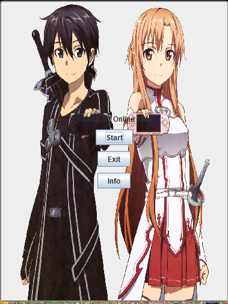
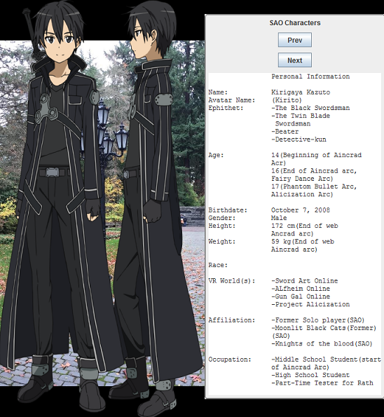

# SAOWikiFolder
  Sword Art Online Character Document

# Things used in project
  Created on Ecipse 
  JButton for Start, Information, and Exit to close appliction
  JFrames for windows 
  JButton to move through characters
  ImageIcon array for Character Images
  An array for text.txt files
  Displays images of character that can be dragged away from the screen
  
# Description
  This application gives you information about some of the Character
  in Sword Art Online Season One and Two.
  By clicking the start button you can go through the characters information.
 
# Screenshot

